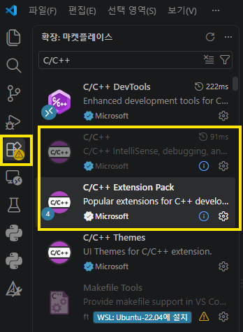
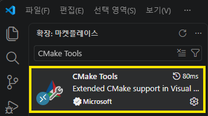
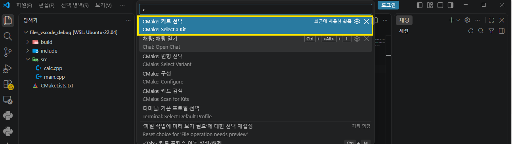
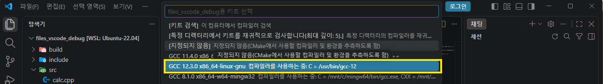
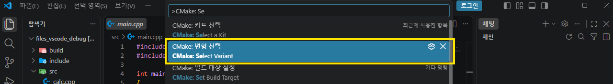
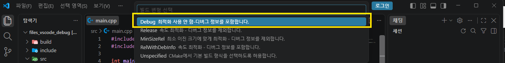
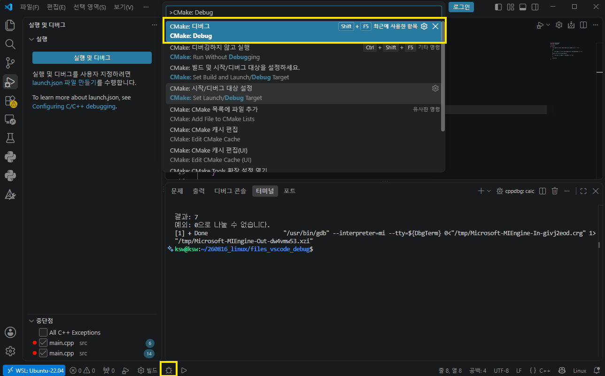
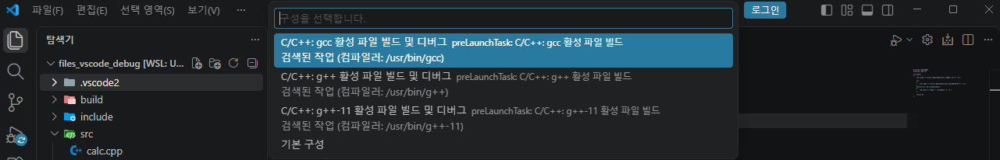

> 아래 내용은 컴파일, 빌드를 수행한 이후 동작이 필요함.

# 필요 파일 설치



# vscode - Ctrl + Shift + P → CMake : Select a Kit 선택, gcc 선택




# CMake: Select Variant → Debug 선택



# F7로 빌드 수행

# 디버깅 방법 (2가지)
## 1. 상단 명령어 혹은 하단 아이콘 버튼으로 디버깅 시작
 

 ## 2-1. .vscode/launch.json 생성하여 아래 코드 입력 ( l )
 >launch.json이 없으면 F5 눌렀을 때 선택 화면이 출력된다.  vs code가 디버깅 할 주체를 선택하지 못해 출력되는 창으로써 출력된 목록은 cpptools를 의미한다.


> "program": "${command:cmake.launchTargetPath}”: 실행 파일 경로를 하드코딩하지 않고 CMake Tools가 현재 선택된 타겟 경로를 알려주도록 하는 방식.
빌드 폴더 이름이나 타겟이 바뀌어도 오류가 발생하지 않는다.

```json
// .vscode/launch.json
{
  "version": "0.2.0",
  "configurations": [
    {
      "name": "CMake 디버그",
      "type": "cppdbg",
      "request": "launch",
      "program": "${command:cmake.launchTargetPath}",
      "args": [],
      "cwd": "${workspaceFolder}",
      "stopAtEntry": false,
      "externalConsole": false,
      "MIMode": "gdb",
      "setupCommands": [
        {
          "description": "gdb pretty-printing 활성화",
          "text": "-enable-pretty-printing",
          "ignoreFailures": true
        }
      ]
    }
  ]
}
```

## 2-2. F5 버튼으로 디버그 실행